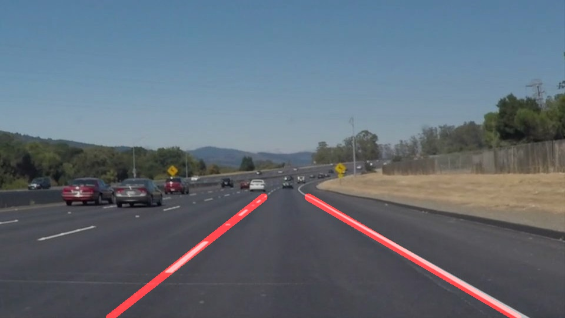

# **Finding Lane Lines on the Road - Udacity CarND Project 1** 

Overview - Challenge
---

When we drive, we use our eyes to decide where to go.  The lines on the road that show us where the lanes are act as our constant reference for where to steer the vehicle.  Naturally, one of the first things we would like to do in developing a self-driving car is to automatically detect lane lines using an algorithm.

In this project we will detect lane lines in images using Python and OpenCV.  OpenCV means "Open-Source Computer Vision", which is a package that has many useful tools for analyzing images.  

Implementation
---

This project is implemented in iPython notebook using Python language. All the packages were installed in local system and imported in Jupyter Notebook as per required.

Reflection
---

## 1. The pipeline

I have built a 6 step pipeline to approach the solution using the helper funtions. The aim here is to identify the Lane Lines in a stream  of video. And as a first step to achive this, I have implemented the lane identification on road images provided. Then this implementation is extended to video stream in the next step.

- Grey Scale Converion
Original colored image (RGB channels) is imported in notebook and converted to a greyscale image as a first step to reduce  complexity.

- Guassian Smoothing
Next Guassian smoothing is applied on the image to reduce noise with Kernel size of 5.

- Canny Transform
Next Canny transform is applied on the image for edge detection. We use low threshold of 50 and high  threshold value of 150.

- Region of Interest detection 
Canny output is procssed to limit the detected edges only to  probable lane lines. fillPoly with quadrilateral vertices are used to identify the region of interest.

- Applying Hough Transform
Next Hough transform is applied to identify straight lines. The line coordinates are used to draw lane lines using cv2.line() functions. There were 2 challenges I faced with the Hough lines- broken line segments instead of full lines and wrong lane lines due to noise.
The Hough  transform output can produce segments instead of full lines. I have used cv2.filLine() method to extrapolate the lines.
To avoid wrong lane lines, we can use slope and use the Hough lines which have slope more than 0.5. This reduced the noise by a great deal.

- Draw Lane Lines
Finally draw the identified Lane Lines on the orginal image with funtion cv2.addWeighted().

  

## 2. Identify any shortcomings
The limitation of this implementation is it works mostly for straight lane lines. When the implementation is run on a curved lane, the lane lines drawn are quite noisy.
Also outside the road area can impact lane identification as seen in challenge video, where lot of noise is introduced by other objects and lanes are mis identified or noise is introduced in the final output.

## 3. Suggest possible improvements
I think  the noise can be reduced to a great extend by manipulation the slope as it has been observed the challenge video output. It can be tuned further to draw lane lines within a specific slope. 
Also manipulating the Hough parameters to identify the curves and modifiying the region of interest to include curves may help in proper identification of curved Lane Lines.

